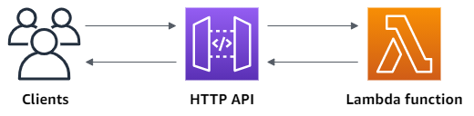
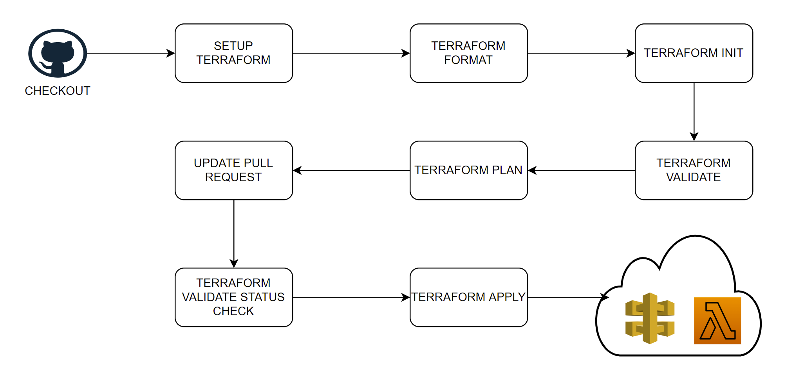

#Infrastructure as code (IaC) using Terraform - API Gateway v2 (HTTP API) + Lambda + GITHUB Actions

**Problem Statement**:
- Implement infrastructure as code (IaC) for a simple web application that runs on AWS Lambda that prints the request header, method, and body.
- The application should be integrated with CI/CD, regardless if it uses simple GitHub actions, or any other related technology to take the code from the repository till the deployment environment

## Architecture of Infrastructure 



- A simple web application which runs on AWS Lambda can be exposed/triggered through API Gateway in AWS cloud, the above picture describes the architecture which is used to expose the lambda
- Lambda function has been implemented in python which relays on the event object sent by API Gateway to extract required information (Content-Type, Method, Username and Password).
- Infrastructure has been automated using Terraform with aws as provider (module based terraform code has been implemented, Please find below steps)
  1. Created IAM roles, polices and attached roles and polices for lambda so that lambda can use other AWS services and also write logs to cloudwatch
  2. Created an archive of application (lambda) source code.
  3. Created Lambda function by passing the location of archived source code and also given lambda permissions to APIGW
  4. Created APIGW, integrated the same with lambda by adding two routes GET and POST and created a default stage and deployed the same
  5. Access logging has been enabled on APIGW stage so that logs will be generated in cloudwatch log groups.
  
Please find the project code structure shown below

## Code structure
```
.
├── .github
│  └── workflows
│      ├── ci.yaml
├── doc
│   ├──  Aws-APIGw-Lambda-Architecture.png
│   ├──  CICD-Flow.png
├── envs
│   └── dev
│       ├── aws.tf
│       └── main.tf
└── module
│   ├── api-gw
│   │   ├── apigw.tf
│   │   ├── outputs.tf
│   │   └── vars.tf
│   └── lambda
│       ├── iam.tf
│       ├── lambda.tf
│       ├── lambda-iam-cloudwatch-policy.json
│       ├── lambda-iam-lambda-policy.json
│       ├── lambda-iam-role.json
│       ├── outputs.tf
│       ├── src
│       │   └── lambda.py
│       ├── archive
│       │   └── lambda.zip
│       └── vars.tf
├── CHALLENGE.md
├── README.md
```
## Integration with CI/CD

This section solves the second part of the problem statement. 

CI/CD has been implemented using the GITHUB Actions. 

Please refer to below diagram for the CICD workflow using GITHUB Actions



- Note: After the below tests are successful and If the stack is required to clean (or destroy to terraform resources), please add Terraform destroy step to the GITHUB Actions configuration in ci.yml file. 


## Test Results:

After a successful Terraform apply, tests were run in multiple ways such as running test through postman, browser and curl. providing logs from postman for GET, POST and PUT requests including payload. 

Usecase-1: POST Request

```
POST https://8n3cntycdi.execute-api.us-east-1.amazonaws.com/api
200
172 ms
POST /api HTTP/1.1
Content-Type: application/json
User-Agent: PostmanRuntime/7.28.4
Accept: */*
Postman-Token: f3e09177-6720-4aa6-9468-f8fe822a4c63
Host: 8n3cntycdi.execute-api.us-east-1.amazonaws.com
Accept-Encoding: gzip, deflate, br
Connection: keep-alive
Content-Length: 60
 
{
"username": "srini",
"password": "pass44pass"
}
 
HTTP/1.1 200 OK
Date: Sun, 31 Oct 2021 11:36:43 GMT
Content-Type: application/json
Content-Length: 214
Connection: keep-alive
Apigw-Requestid: IEjn1iFSoAMEPQg=
 
{"welcome message": "Welcome to our demo API, here are the details of your request", "statuscode": 200, "headers": {"Content-Type": "application/json"}, "method": "POST", "body": {"username": "srini", "password": "pass44pass"}}
```

Usecase-2: GET Request (with payload)

```
GET https://8n3cntycdi.execute-api.us-east-1.amazonaws.com/api
200
579 ms
GET /api HTTP/1.1
Content-Type: application/json
User-Agent: PostmanRuntime/7.28.4
Accept: */*
Postman-Token: 66fa2c7c-8438-4016-8e63-1b19be81e12e
Host: 8n3cntycdi.execute-api.us-east-1.amazonaws.com
Accept-Encoding: gzip, deflate, br
Connection: keep-alive
Content-Length: 42
 
{"username":"srini", "password":"getpass"}
 
HTTP/1.1 200 OK
Date: Sun, 31 Oct 2021 11:36:36 GMT
Content-Type: application/json
Content-Length: 210
Connection: close
Apigw-Requestid: IEjmphRWoAMEPNw=
 
{"welcome message": "Welcome to our demo API, here are the details of your request", "statuscode": 200, "headers": {"Content-Type": "application/json"}, "method": "GET", "body": {"username": "srini", "password": "getpass"}}
```

Usecase-3: GET Request (without payload)

```
GET https://8n3cntycdi.execute-api.us-east-1.amazonaws.com/api
200
401 ms
GET /api HTTP/1.1
Content-Type: application/json
User-Agent: PostmanRuntime/7.28.4
Accept: */*
Postman-Token: 15f3a93b-3793-4cec-98ae-e4567e35aec8
Host: 8n3cntycdi.execute-api.us-east-1.amazonaws.com
Accept-Encoding: gzip, deflate, br
Connection: keep-alive
 
HTTP/1.1 200 OK
Date: Sun, 31 Oct 2021 11:36:40 GMT
Content-Type: application/json
Content-Length: 170
Connection: keep-alive
Apigw-Requestid: IEjnSiA2oAMEPkw=
 
{"welcome message": "Welcome to our demo API, here are the details of your request", "statuscode": 200, "headers": {"Content-Type": "application/json"}, "method": "GET", "body": null}
```

Usecase-4: PUT Request

```
PUT https://8n3cntycdi.execute-api.us-east-1.amazonaws.com/api
404
128 ms
PUT /api HTTP/1.1
Content-Type: application/json
User-Agent: PostmanRuntime/7.28.4
Accept: */*
Postman-Token: d64f8b9a-facf-40d5-9f2a-d52286c76767
Host: 8n3cntycdi.execute-api.us-east-1.amazonaws.com
Accept-Encoding: gzip, deflate, br
Connection: keep-alive
Content-Length: 59
 
{
"username": "srini",
"password": "pass4pass"
}
 
HTTP/1.1 404 Not Found
Date: Sun, 31 Oct 2021 11:25:46 GMT
Content-Type: application/json
Content-Length: 23
Connection: keep-alive
apigw-requestid: IEiBHgH1oAMEVOw=
 
{"message":"Not Found"}
```